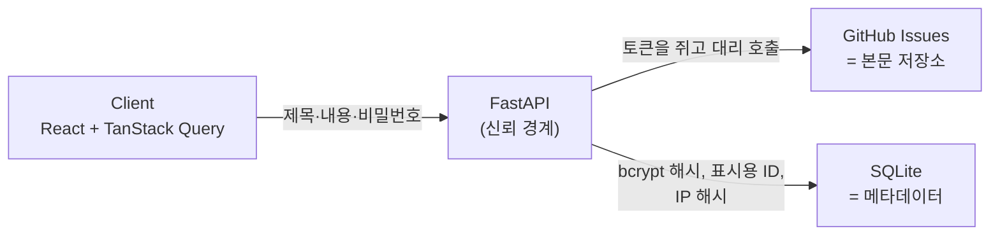

# n_n

**서버 없이 익명 게시판을 만들 수 있을까?**

`n_n` 은 `no_name` 의 줄임말입니다. 이 저장소는 완성된 서비스가 아니라,
위 질문을 직접 구현해서 확인해 본 **기술 검증 기록**입니다.

---

## 왜 시작했나

Blind 같은 익명 커뮤니티는 "재직자인지 확인"하면서 동시에 "누가 썼는지 모른다"를
같이 만족시켜야 합니다. 이게 어떻게 가능한지 궁금했습니다.

저는 프론트엔드 개발자라서 두 번째 질문이 따라붙었습니다.
**인프라 없이, 프론트엔드만으로 어디까지 갈 수 있을까?**

GitHub Issues 를 글 저장소로 쓰면 서버가 필요 없을 것 같았습니다.
글은 이슈로 쌓이고, 목록은 REST API 로 읽고, 호스팅은 정적 배포로 끝.

---

## 1단계 — 서버 없이 (2026-04-05 ~ 04-06)

클라이언트가 GitHub Issues API 를 직접 호출하는 형태로 만들었습니다.
글쓰기와 목록 조회가 실제로 동작했습니다.

> 해당 구현: [`b946efb`](../../commit/b946efb) *feat: implement create and read operations using GitHub Issues API*

그리고 벽 세 개를 만났습니다.

### 벽 1. 클라이언트가 쥔 토큰은 공개된 토큰이다

이슈를 **쓰려면** 저장소 쓰기 권한 토큰이 필요합니다. 그래서
`import.meta.env.VITE_GITHUB_TOKEN` 을 읽어 헤더에 실었습니다.

그런데 Vite 는 `VITE_*` 를 빌드 시점에 번들에 문자열로 인라인합니다.
즉 배포하는 순간 **누구나 그 토큰으로 내 저장소에 쓸 수 있습니다.**
난독화로 가릴 수 있는 문제가 아니라, 클라이언트에 비밀을 둘 수 없다는
구조의 문제였습니다.

→ 저장소 접근을 대신 해 줄 **신뢰 경계**가 필요하다.

### 벽 2. 클라이언트가 하는 검증은 검증이 아니다

익명 게시판이라 로그인이 없습니다. 대신 글마다 비밀번호를 받아서
수정·삭제 권한을 확인하려고 했습니다. 그런데 비교를 클라이언트가 하면
개발자 도구로 그 분기를 건너뛰면 끝입니다.

→ 검증 주체가 클라이언트 밖에 있어야 한다.

### 벽 3. 클라이언트는 자기 IP 를 신뢰 가능하게 말할 수 없다

도배를 막으려면 요청자를 구분해야 합니다. 로그인이 없으니 IP 가
유일한 단서인데, IP 는 요청을 **받는 쪽**만 알 수 있습니다.

→ 요청을 받는 지점이 필요하다.

---

## 2단계 — 결론: 서버 없이는 불가능하다 (2026-04-19 ~)

세 개의 벽은 모두 "믿을 수 있는 제3자가 필요하다"는 같은 말이었습니다.
그래서 **최소한의 신뢰 경계**로 FastAPI 서버를 도입했습니다.

> 도입 시점: [`ed9efa3`](../../commit/ed9efa3) *feat: separate server and client environment configurations*

서버가 생긴 뒤에도 원래 의도는 유지했습니다. 서버는 **비밀을 쥐고 검증만**
하고, 글 본문은 그대로 GitHub Issues 에 둡니다.



| 저장소 | 담는 것 | 이유 |
|---|---|---|
| GitHub Issues | 제목, 본문 | 공개돼도 되는 콘텐츠. 인프라 비용 0 |
| SQLite | bcrypt 해시, 표시용 ID, IP 해시 | 공개되면 안 되는 값. 콘텐츠 저장소에 올리지 않는다 |

권한 검증은 [`server/security.py`](server/security.py) 한 곳에 모았습니다.
1단계에서 못 했던 일이 정확히 이 파일에서 됩니다.

---

## 덤으로 만난 문제 — GitHub 목록 API 의 인덱싱 지연

글을 쓰고 목록을 새로고침하면 **방금 쓴 글이 없었습니다.** 잠시 뒤에는
나타났습니다. 이슈 목록 API 가 검색 인덱스를 거치기 때문에 생성 직후
바로 반영되지 않는 것이었습니다.

낙관적 업데이트로 화면에는 즉시 그렸지만, 서버 응답이 돌아오면 다시
사라졌습니다. 화면 문제가 아니라 데이터 원천의 문제였습니다.

**해결**: 목록의 원천을 로컬 메타 DB 로 바꿨습니다. GitHub 목록 응답에
없는 이슈만 **단일 이슈 API** 로 따로 조회합니다. 단일 조회는 인덱스를
타지 않아 즉시 반영됩니다.

> 구현: [`server/main.py`](server/main.py) 의 `list_posts`
> / 커밋 [`83ed9ab`](../../commit/83ed9ab) *feat: fix github issue latency*

외부 API 를 저장소로 쓰면 **일관성 모델까지 따라온다**는 걸 여기서 배웠습니다.

---

## 기술 스택

**Client** — React 19, Vite, TypeScript, TanStack Query v5, React Hook Form + Zod, Tailwind CSS v4
**Server** — FastAPI, SQLModel, SQLite, httpx, bcrypt
**공통** — Biome (포맷·린트), GitHub Actions

프론트엔드에서 눈여겨볼 부분:
- [`use-posts.ts`](client/src/hooks/use-posts.ts) — 낙관적 업데이트. `cancelQueries` → 스냅샷 → 실패 시 롤백 → `onSettled` 무효화
- [`post-form.tsx`](client/src/components/post-form.tsx) — Zod 스키마 기반 검증
- 게시·삭제 로딩 상태를 뮤테이션별로 분리해 각 버튼에 반영

---

## 실행

```bash
# 1) 환경변수
cat > server/.env <<'ENV'
GITHUB_TOKEN=<repo 쓰기 권한 토큰>
REPO_OWNER=<저장소 소유자>
REPO_NAME=<이슈를 쌓을 저장소>
SECRET_SALT=<IP 해싱용 임의 문자열>
ENV

# 2) 의존성
npm run install:all

# 3) 클라이언트 + 서버 동시 실행
npm run dev
```

SQLite 파일은 서버가 뜰 때 `init_db()` 가 만듭니다. (저장소에 커밋하지 않습니다)

---

## 한계 — 알고 있고, 고치지 않은 것

이 저장소의 목적은 위 질문에 답하는 것이지 서비스를 완성하는 것이 아닙니다.
아래는 **인지하고 남겨둔** 부분입니다.

- **익명성 설계가 미완입니다.** `ip_hash` 와 게시글이 같은 행에 있습니다.
  IP 는 경우의 수가 적어서 `SECRET_SALT` 를 아는 쪽이라면 후보를 대입해
  원본 IP 를 좁힐 수 있습니다. Blind 류의 핵심은 "검증은 하되 신원과
  게시물의 연결을 구조적으로 끊는 것"인데, 거기까지는 가지 못했습니다.
- **도배 방지 로직이 없습니다.** `ip_hash` 를 저장만 하고 rate limiting 은
  구현하지 않았습니다.
- **목록이 최근 10개까지만 나옵니다.** 목록의 원천이 로컬 DB 이고
  `RECENT_POSTS_LIMIT` 로 잘라 읽습니다. 커서 기반 페이지네이션이
  필요합니다.
- **수정 기능은 서버에만 있습니다.** `PATCH /update_issue` 는 동작하지만
  클라이언트 UI 는 만들지 않았습니다.
- **테스트가 없습니다.** CI 는 Biome 린트만 돌립니다.
- **배포하지 않았습니다.** CORS 허용 출처가 localhost 로 고정돼 있습니다.
- 피드백이 `alert()` 기반입니다.

---

## 정리

시작한 질문의 답은 **"안 된다"** 였습니다.
쓰기 권한, 권한 검증, 요청자 식별 — 이 세 가지 중 하나라도 필요하면
클라이언트만으로는 닫히지 않습니다.

프론트엔드만 해 오던 입장에서 백엔드가 "왜" 있는지를 문서로 읽는 대신
막혀서 도입하는 순서로 겪어 본 게 이 프로젝트에서 가장 남는 부분입니다.

## License

MIT
